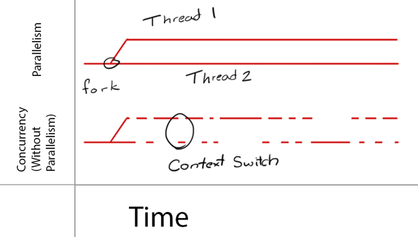

Go Language
=====

- [Go Language](#go-language)
  - [Installation](#installation)
  - [Folder Structure](#folder-structure)
  - [Hello world](#hello-world)
  - [Terminal commands](#terminal-commands)
    - [Testing](#testing)
  - [General](#general)
  - [Variables](#variables)
    - [Scalar](#scalar)
    - [Reference](#reference)
    - [Slice](#slice)
    - [Map](#map)
  - [Constants](#constants)
  - [Functions](#functions)
  - [Scopes](#scopes)
  - [Conditional logic](#conditional-logic)
  - [Structs](#structs)
  - [JSON](#json)
    - [Marshalling](#marshalling)
    - [Encoding](#encoding)
  - [Interfaces](#interfaces)
  - [Concurrency and parallelism](#concurrency-and-parallelism)
    - [Race conditions](#race-conditions)
  - [Channels](#channels)
  - [Additional resources](#additional-resources)

## Installation

1. Set the `GOROOT`
1. Add export `PATH=$PATH:/usr/local/go/bin` to `/etc/profile`
1. Add export `GOPATH=$HOME/<workspace_name>` to `~/.profile`
1. Add export `PATH=$HOME/<workspace_name>/bin:$PATH` to `~/.profile`

## Folder Structure

- go
  - bin
  - pkg
  - src
    - github.com
      - username
        - project repo 1
        - project repo 2

## Hello world

```go
package main

import "fmt"

func main() {
	fmt.Println("Hello World")
}
```

## Terminal commands

```bash
# Show all environment variables
go env

# Format all files
go fmt

# Run the main file
go run main.go

# Build executable
go build

# Run the executable you just built
./main.exe

# Create a globally accessible executable
go install # The file will be placed in $HOME/<workspace_name>/bin
```

### Testing

```sh
# Run all tests in current directory
go test

# Run all tests in current directory and all of its subdirectories:
go test ./...

# Run all tests with import path prefixed with foo/:
go test foo/...

# This should run all tests import path prefixed with foo:
go test foo...

# This should run all tests in your $GOPATH:
go test ...
```

## General

- The folder name needs to be the same as the package name
- For something to be executable, it needs `package main` and `func main() {}`
- If the first letter of a function is capitalized, then this function will be exported (visible) outside the package 
- The `main.go` file with the `func main() {}` is the executable file. When you run `go build` from the terminal in that directory it will build the executable `main.exe` file in that directory

## Variables

### Scalar

- Shorthand syntax can only be used inside `func`
- Declared variables get set to their *"zero"* value

```go
// Declare a variable, then assign it a value
var n int    //=> 0
var x string //=> ''
x = "hello"  //=> hello
x[1]         //=> e
"hello"[1]   //=> e

// Declared with shorthand
a:= 10
b:= "golang"

// Exported variable
var MyString = "hello" // Note the capitalization of the first letter
```

### Reference

- **Slices** hold references to an underlying array, and if you assign one slice to another, both refer to the same array. 
- If a function takes a slice argument, changes it makes to the elements of the slice will be visible to the caller, analogous to passing a pointer to the underlying array.
- To get the address of a variable named `person` call `&person`

### Slice

```go
// Declare an empty slice of int with 17 slots
a := make([]int, 17)

// Declare a slice of string
mySlice := []string{"a", "b", "c", "d", "e"}

// Access an element of a slice
mySlice[1]  //=> "b"
mySlice[len(mySlice)-1] // last element of slice

// Get a slice of a slice 
newSlice := mySlice[:1] //=> [a]
newSlice := mySlice[2:4] //=> [c d]
newSlice := mySlice[3:] //=> [d e]


// Append a slice to a slice
b := append(mySlice, newSlice...)

// Delete from a slice
a = append(a[:i], a[j:]...)
a = append(a[:i], a[i+1:]...)

```

Additional tricks: https://github.com/golang/go/wiki/SliceTricks

### Map

```go
// Declare a map of integers
ages := make(map[string]int)
ages["Kevin"] = 32
ages["Kim"] = 27

// Declare and initialize a new map
b := map[string]int{"foo": 1, "bar": 2}

// Check if the value is present
age, exists := ages["Kevin"]
age //=> 32
exists //=> true

// Delete the value and check if it's present
delete(ages, "Kevin")
_, exists := ages["Kevin"]
exists //=> false
```

**Loop over maps**

```go
for key, val := range myMap {
  fmt.Println(key, " - ", val)
}
```

**Additional maps**

```go
myGreeting := make(map[string]string)
myGreeting["Tim"] = "Good morning."
myGreeting["Jenny"] = "Bonjour."

// OR

myGreeting := map[string]string{
  "Tim": "Good morning."
  "Jenny": "Bonjour."
}

// OR

myGreeting := map[int]string{
  0: "Good morning."
  1: "Bonjour."
}

if val, ok := myGreeting[2]; ok {
  fmt.Println("The value exists")
} else {
  fmt.Println("The value does NOT exist")
}

elements := map[string]string{
  "H":  "Hydrogen",
  "He": "Helium",
}

// A map of maps

elements := map[string]map[string]string{
  "H": map[string]string{
    "name":"Hydrogen",
    "state":"gas",
  },
  "He": map[string]string{
    "name":"Helium",
    "state":"gas",
  },
}
```

## Constants

```go
// Declare a single constant
const language = "Go"

// Declare multiple constants
const (
  pi = 3.14
  language = "Go"
)
```

## Functions

```go
// Declare a function of type string
func myFunc() string  { return "hello" } 

// Declare an exported function of type string
func MyFunc() string  { return "hello" } // Note the capitalization of the first letter

// Accept to string arguments and return multiple values
func fullName(first_name, last_name string) string {
  return fmt.Sprint(first_name, last_name), fmt.Sprint(last_name, first_name)
}
```

**Create a variadic function:**

```go
/*
Note the ellipsis prefix for the float64 type, denoting that this function
  accepts 0 or more arguments
*/
func average(numbers ...float64) float64 {
  total := 0.0
  for _, v := range numbers {
    total += v
  }
  return total / float64(len(numbers))
}

/*
Note the ellipsis postfix for the float64 slice, denoting that the values
  will be split into a comma separated list
*/
data := []float64{43, 56, 12}
n := average(data...)
```

**Callbacks:**

```go
// The first parameter is a slice of integers
// The second parameter is a function that takes an int parameter
func visit(numbers []int, callback func(int)) {
  for _, v := range numbers {
    callback(v)
  }
}

func main() {
  // The first argument is a slice of integers
  // The second argument is an anonymous function that has an int argument
  visit([]int{1, 2, 3, 4}, func(n int) {
    fmt.Println(n)
  })
}
```

## Scopes

Levels: universe, package, file, block (curly braces)

## Conditional logic

```go
// Initialization statement in an if statement
b := true
if food := "Chocolate"; b {
  fmt.PrintLn(food)
}
// the food variable is not available outside the if block
```

```go
// Switch based on type
type Contact struct {
  greeting string
  name     string
}
x := 42

switch x.(type) {
case int:
  fmt.Println("int")
case string:
  fmt.Println("string")
case Contact:
  fmt.Println("contact")
default:
  fmt.Println("unknown")
}
```

## Structs

```go
type Person struct {
  First string // A person has a first name of type string
  Last  string
  Age   int
}

type DoubleZero struct {
  Person                // A Double Zero is a type of person
  First         string
  Last          string
  licenseToKill bool   // This will not be exported
}

func (p Person) fullName() string {
  return p.First + " " + p.Last
}

func (p DoubleZero) fullName() string {
  return p.Person.Last + ", " + p.Person.First + " " + p.Person.Last
}

p1 := DoubleZero{
  Person: Person{
    First: "James", 
    Last: "Bond", 
    Age: 20
  },
  First: "Bond",
  Last: "James Bond",
  licenseToKill: true,
}

p2 := Person{"Miss", "MoneyPenny", 18}

fmt.Println(p1.First)             //=> Bond
fmt.Println(p1.Person.First)      //=> James
fmt.Println(p1.fullName())        //=> Bond, James Bond
fmt.Println(p1.Person.fullName()) //=> James Bond
```

## JSON

### Marshalling

- **Marshalling/unmarshalling** is when you convert bytes from one format to another

```go
import (
  "encoding/json"
  "fmt"
)

type Person struct {
  First string
  Last  string `json:"-"` // This will not be part of JSON response
  Age   int    `json:"wisdom score"`
}

func main() {
	// Convert to JSON
	p1 := Person{"James", "Bond", 20}
	byteSlice, _ := json.Marshal(p1)
	fmt.Println(string(byteSlice)) //=> {"First":"James","wisdom score":20}

	// Convert from JSON
	var p2 Person
	byteSlice = []byte(`{"First":"James","wisdom score":20}`)
	json.Unmarshal(byteSlice, &p2)
	fmt.Println(p2.First) //=> James
	fmt.Println(p2.Last)  //=>
}
```

### Encoding

- **Encoding/decoding** is when you convert a stream of data (usually from an external source) from one format to another

```go
import (
	"encoding/json"
	"fmt"
	"os"
	"strings"
)

type Person struct {
	First string
	Last  string 
	Age   int    
}

func main() {
	// Convert to JSON
	p1 := Person{"James", "Bond", 20}
	json.NewEncoder(os.Stdout).Encode(p1) //=> {"First":"James", "Last": "Bond", "Age":20}

	// Convert from JSON
	var p2 Person
	reader := strings.NewReader(`{"First":"James", "Last": "Bond", "Age":20}`)
	json.NewDecoder(reader).Decode(&p2)
	fmt.Println(p2.Last) //=> Bond
}
```

## Interfaces

```go
import (
	"fmt"
	"math"
)

type Square struct {
	side float64
}

type Rectangle struct {
	xSide, ySide float64
}

type Circle struct {
	radius float64
}

type Shape interface {
	area() float64
}

func (s Square) area() float64 {
	return s.side * s.side
}

func (r Rectangle) area() float64 {
	return r.xSide * r.ySide
}

func (c Circle) area() float64 {
	return math.Pi * c.radius * c.radius
}

func info(s Shape) {
	fmt.Printf("%T \n", s)
	fmt.Println(s.area())
}

func main() {
	square := Square{10}
	rectangle := Rectangle{5, 10}
	circle := Circle{5}

	info(square)    //=> main.Square
	info(rectangle) //=> main.Rectangle
	info(circle)    //=> main.Circle
}

```

## Concurrency and parallelism



- **Concurrency:** Doing many things, but only one at a time "multitasking"
- **Parallelism:** Doing many things at the same time

A goroutine is a function that is capable of running concurrently with other functions. To create a goroutine we use the keyword go followed by a function invocation:

```go
import "fmt"

func f(n int) {
  for i := 0; i < 10; i++ {
    fmt.Println(n, ":", i)
  }
}

func main() {
  go f(0)
  var input string
  fmt.Scanln(&input)
}
```

This program consists of two goroutines. The first goroutine is implicit and is the main function itself. The second goroutine is created when we call go f(0). Normally when we invoke a function our program will execute all the statements in a function and then return to the next line following the invocation. With a goroutine we return immediately to the next line and don't wait for the function to complete. This is why the call to the Scanln function has been included; without it the program would exit before being given the opportunity to print all the numbers.

```go
package main

import (
	"fmt"
	"math/rand"
	"sync"
	"time"
)

var wg sync.WaitGroup
var counter int

// Mutual exclusion object (Mutex) is created so that multiple threads can take
// turns sharing the same resource.
var mutex sync.Mutex

// Main is a go routine
func main() {
	wg.Add(2)              // Add 2 items to the wait group
	go incrementor("Foo:") // This is the second go routine
	go incrementor("Bar:") // This is the third go routine
	wg.Wait()              // This will wait till all the items are removed from the wait group
	fmt.Println("Final Counter:", counter)
}

func incrementor(s string) {
	for i := 0; i < 20; i++ {
		// Wait a random amount of milliseconds
		time.Sleep(time.Duration(rand.Intn(20)) * time.Millisecond)
		{
			mutex.Lock()
			counter++
			fmt.Println(s, i, "Counter:", counter)
			mutex.Unlock()
		}
	}
	wg.Done() // This removes one item from the wait group
}

```

**NOTE: Adding `Mutex` or `atomicity` to your program can create a bottle neck for performance**

### Race conditions

To check for a race condition in your code run:

```go
go run -race main.go
```

## Channels

## Additional resources

1. https://github.com/alco/gostart
